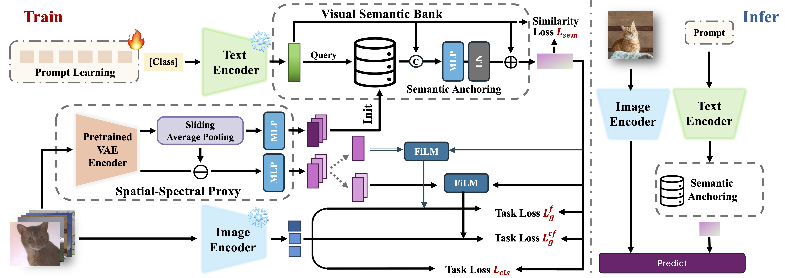

<div align="center">

# SpecPL: Disentangling Spectral Granularity for Prompt Learning

**Jingtao Zhou\*, Xirui Kang\*, Feiyang Huang\*, Lai-Man Po†**  
(*City University of Hong Kong*)  
<small>\* Equal Contribution &nbsp;&nbsp; † Corresponding Author</small>

<br>

[](#)
[](#)
[](https://opensource.org/licenses/MIT)

**Official PyTorch implementation of "SpecPL: Disentangling Spectral Granularity for Prompt Learning" (ICML 2026).**

</div>
---

> **🚧 Code Coming Soon**  
> We are currently cleaning up the codebase for public release. The core implementation, pre-trained weights, and detailed instructions for reproducing the experiments will be made available here shortly.

## 📖 TL;DR

**SpecPL** is a granularity-aware prompt learning framework designed to bridge the gap in fine-grained visual discrimination for Vision-Language Models (VLMs). By leveraging a frozen VAE as a spatial-spectral proxy, SpecPL disentangles visual representations into low-frequency semantics (Base) and high-frequency discriminative details (Detail), significantly enhancing adaptation performance on fine-grained tasks without introducing additional inference overhead.

<div align="center">
  
  <p><em>Illustration of the Spatial-Spectral Proxy and Granularity Disentanglement.</em></p>
</div>

## ⏳ News & Timeline

- **[May 2026]** SpecPL has been accepted to **ICML 2026**! 🎉
- **[TBD]** Release arXiv preprint.
- **[TBD]** Release the core training and evaluation code.


## ⚙️ Requirements

We recommend using **Python 3.9** and **PyTorch 2.1.2** with CUDA 11.8. 

**1. Create a Conda environment:**
```bash
conda create -n specpl python=3.9 -y
conda activate specpl
```

**2. Install PyTorch & Torchvision:**

```bash
pip install torch==2.1.2 torchvision==0.16.2 --index-url [https://download.pytorch.org/whl/cu118](https://download.pytorch.org/whl/cu118)
```
**3.Install standard dependencies:**

```bash
pip install diffusers==0.35.2 ftfy==6.3.1 numpy==2.3.4 Pillow==12.0.0 regex==2025.10.23 scikit-learn==1.7.2 scipy==1.16.2 timm==1.0.21 tqdm==4.64.1 yacs==0.1.8
```
**Install Dassl.pytorch:**
SpecPL relies on the Dassl toolbox for prompt learning operations. Please install it from source:
```bash
git clone [https://github.com/KaiyangZhou/Dassl.pytorch.git](https://github.com/KaiyangZhou/Dassl.pytorch.git)
cd Dassl.pytorch/
python setup.py develop
cd ..
```
## 📍 Citation

If you find this project helpful for your research, please consider citing our paper:
```bibtex
@inproceedings{zhou2026specpl,
  title={SpecPL: Disentangling Spectral Granularity for Prompt Learning},
  author={Zhou, Jingtao and Kang, Xirui and Huang, Feiyang and Po, Lai-Man},
  booktitle={Proceedings of the 43rd International Conference on Machine Learning (ICML)},
  year={2026}
}